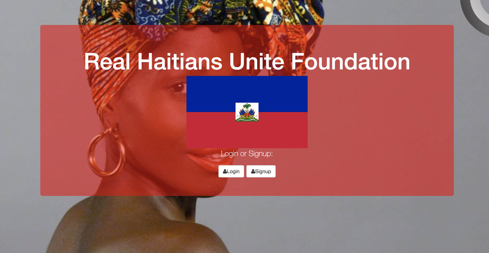

# Khorallys-21 Savage Demo Auth- Code Lyoko version

Welcome to my Savage Demo APP! I added a code lyoko theme to add some originality. Here, users can add a message, then give it a thumbs up, thumbs down, or delete it.

# How It's Made:
Tech used: HTML, CSS, JavaScript, and MongoDB. I especially enjoyed incorporating the node_modules in this project so that it could work server site in addition to client side. The original version did not have a functional thumbs down button, but I fixed the issue by modifying the CRUD API and making necessary changes in my other files connected to the server. I also added a log in / sign up feature. This was practice for my Code Lyoko fan page, which can be found [here](https://github.com/KhorallyPierre/Code-Lyoko-Login)

# Lessons Learned:
I learned that when running files server-side it's important to kill the server and rerun node server.js in the command line every time. I learned how to read through error messages to debug with more confidence and understanding.

Examples:
Take a look at these couple examples that I have in my own portfolio:

https://wonderful-easley-4bdc4b.netlify.app/

https://hopeful-hamilton-96af68.netlify.app/

https://zealous-dubinsky-e78c32.netlify.app
